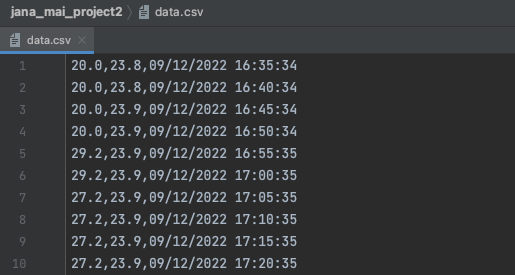
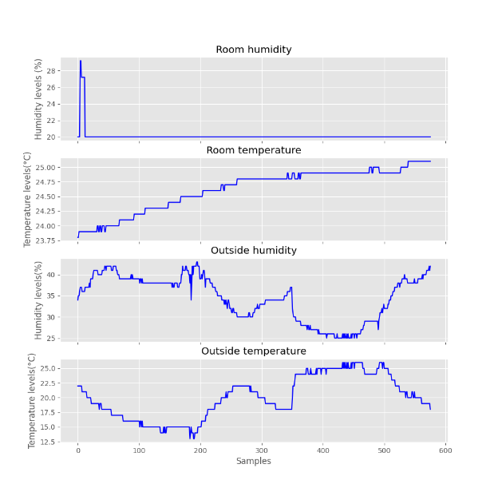
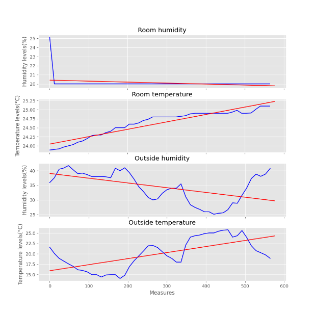

<sub>Fig.1 show Winnie The Pooh Snow GIF from tenor.com

# Unit 2: A Distributed Weather Station for ISAK

## Criteria A: Planning

## Problem definition

It is December in UWC ISAK and Our client is starting to feel cold and sick. He suspects that the reason behind his cold is the change of humidity on campus. The reason behind his suspicion is that high humidity promotes the growth of mold which can cause respiratory issues [^1]. For that reason, he went to discuss with a teacher who in fact denied his suspicions and said that it was just because his body is not adapting fast enough, since he is from Africa. To prove his point, he asked us to measure the temperature and humidity both inside and outside of the residences to store all the data in a graph. From the results, it would be able to either confirm his suspicions or deny them. Finally, his last request is for them to make a poster to print out and hang up throughout the school.

## Rationale for Proposed Solution

Considering the client requirements an adequate solution includes a low cost sensing device for humidity and temperature and a custom data script that process and anaysis the samples acquired. For a low cost sensing device an adequate alternative is the DHT11 sensor[^2] which is offered online for less than 5 USD and provides adequare precision and range for the client requirements (Temperature Range: 0°C to 50°C, Humidity Range: 20% to 90%). Similar devices such as the DHT22, AHT20 or the AM2301B [^3] have higher specifications, however the DHT11 uses a simple serial communication (SPI) rather than more eleborated protocols such as the I2C used by the alternatives. For the range, precision and accuracy required in this applicaiton the DHT11 provides the best compromise. Connecting the DHT11 sensor to a computer requires a device that provides a Serial Port communication. A cheap and often used alternative for prototyping is the Arduino UNO microcontroller [^4]. "Arduino is an open-source electronics platform based on easy-to-use hardware and software"[^5]. In additon to the low cost of the Arduino (< 6USD), this devide is programable and expandable[^2]. Other alternatives include diffeerent versions of the original Arduino but their size and price make them a less adequate solution.

Considering the budgetary constrains of the client and the hardware requirements, the software tool that I proposed for this solution is Python. Python is open source, it is mature and supported in mutiple platforms (platform-independent) including macOS, Windows, Linux and can also be used to program the Arduino microprocessor [^6]. In comparison to the alternative C or C++, which share similar features, Python is a High level programming language (HLL) with high abstraction [^8]. For example, memory management is automatic in Python whereas it is responsability of the C/C++ developer to allocate and free up memory [^8], this could result in faster applications but also memory problems. In addition a HLL language will allow me and future developers extend the solution or solve issues proptly.  

It will take 2 weeks to make and will be evaluated according to the criteria A, B and C.  

## Design statement

In order to inform the client whether the temperature and humidity levels are at a healthy level or not, this project aims to develop a low-cost weather station that measures the values inside a dorm room (locally) and outside the house (remotely). Additionally, a forecast for the temperature and humidity for the subsequent 12 hours will be shown. The data will be visualized using mathematical modeling to make it simpler for the client to comprehend. We will use a DHT 11 sensor connected to the Macbook Air to collect the temperature and humidity in order to accomplish this. The program will immediately upload the gathered data into a server to improve the validity and correctness of our estimated data. We'll utilize the tool to keep track of a room's temperature and humidity for 48 hours.


[^1]:American Lung Association. “Mold and Dampness.” Lung.org, 2022, www.lung.org/clean-air/at-home/indoor-air-pollutants/mold-and-dampness. Accessed 12 Dec. 2022.
[^2]: Industries, Adafruit. “DHT11 Basic Temperature-Humidity Sensor + Extras.” Adafruit Industries Blog RSS, https://www.adafruit.com/product/386. 
[^3]: Nelson, Carter. “Modern Replacements for DHT11 and dht22 Sensors.” Adafruit Learning System, https://learn.adafruit.com/modern-replacements-for-dht11-dht22-sensors/what-are-better-alternatives.   
[^4]:“How to Connect dht11 Sensor with Arduino Uno.” Arduino Project Hub, https://create.arduino.cc/projecthub/pibots555/how-to-connect-dht11-sensor-with-arduino-uno-f4d239.  
[^5]:Team, The Arduino. “What Is Arduino?: Arduino Documentation.” Arduino Documentation | Arduino Documentation, https://docs.arduino.cc/learn/starting-guide/whats-arduino.  
[^6]:Tino. “Tino/PyFirmata: Python Interface for the Firmata (Http://Firmata.org/) Protocol. It Is Compliant with Firmata 2.1. Any Help with Updating to 2.2 Is Welcome. the Capability Query Is Implemented, but the Pin State Query Feature Not Yet.” GitHub, https://github.com/tino/pyFirmata. 
[^7]:Python Geeks. “Advantages of Python: Disadvantages of Python.” Python Geeks, 26 June 2021, https://pythongeeks.org/advantages-disadvantages-of-python/. 
[^8]: Real Python. “Python vs C++: Selecting the Right Tool for the Job.” Real Python, Real Python, 19 June 2021, https://realpython.com/python-vs-cpp/#memory-management. 

## Success Criteria

1. The solution provides a visual representation of the Humidity and Temperature values inside a dormitory (Local) and outside the house (Remote) for a period of minimum 48 hours. 
2. The solution provides a mathematical modelling for the Humidity and Temperature levels for each Local and Remote locations. ```(SL: linear model)```
3. The solution provides a comparative analysis for the Humidity and Temperature levels for each Local and Remote locations including mean, standad deviation, minimum, maximum, and median.
4. ```(SL)```The Local samples are stored in a csv file.
5. Create a prediction the subsequent 12 hours for both temperature and humidity.
6. A poster summarizing the visual representations, model and analysis is created and communicated.

# Criteria B: Design

## System Diagram **SL**


<sub>Fig.2 shows the system diagram for the proposed solution (**SL**). 
    
The indoor variables will be measured using an Arduino microprocessor and the sensor DHT11 conencted to the local computer (Laptop) located inside a room. The outdoor variables will be requested to the remote server using a GET request to the API of the server at ```192.168.6.147/readings```. The local values are stored in a CSV database locally.


<sub>Fig.3 shows the system diagram produced by our group (**SL**)

## List of Materials

| Material               | Quantity |
|------------------------|----------|
| Arduino microprocessor | 1        |
| Sensor DHT11           | 1        |
| Computer               | 1        |
| Extension chord        | 1        |

## Flow diagrams


<sub>Fig.4 shows flow diagram for plotting the graph for smoothed temperature graph (inside)


<sub>Fig.5 shows flow diagram for the get sensor reading function from the library


<sub>Fig.6 shows flow diagram for retrieving data from the DHT11 sensor

## Record of Tasks

| **Task No** | **Planned Action**                                                                                                                                                     | **Planned Outcome**                                                                                                                                                                                               | **Time estimate** | **Target completion date** | **Criterion** |
|-------------|------------------------------------------------------------------------------------------------------------------------------------------------------------------------|-------------------------------------------------------------------------------------------------------------------------------------------------------------------------------------------------------------------|-------------------|----------------------------|---------------|
| 1           | Write the Problem context                                                                                                                                              | Identify the audience and their problem                                                                                                                                                                           | 20 min            | Nov 22                     | A             |
| 2           | Create success criteria                                                                                                                                                | Ensure the final product satisfies client's needs                                                                                                                                                                 | 10 min            | Nov 23                     | A             |
| 3           | Write design statement                                                                                                                                                 | Create a mutual understanding between team members and client                                                                                                                                                     | 10 min            | Nov 23                     | A             |
| 4           | Write proposed solution                                                                                                                                                | Recieve feedback and approval to continue development of product                                                                                                                                                  | 10 min            | Nov 24                     | B             |
| 5           | List materials needed                                                                                                                                                  | Establish understanding of materials needed for the product to function and have a better understanding of the system diagram                                                                                     | 10 min            | Nov 24                     | A             |
| 6           | Collect materials and sign scope of work                                                                                                                               | Obtain all the supplies required to build a weather station in the dorm and sign them out with the aim of only doing so for the client                                                                            | 10 min            | Nov 24                     | A             |
| 7           | Download necessary libraries and applications                                                                                                                          | Prepare the computer to accept data from the sensor and to perform upcoming coding                                                                                                                                | 20 min            | Nov 24                     | B             |
| 8           | Import necessary libraries into Python files                                                                                                                           | For the code to be able to receive and process the data into the final product                                                                                                                                    | 15 min            | Nov 25                     | B             |
| 9           | Set up the materials to the computer inside the room                                                                                                                   | Have the Arduino and computer ready to record required data every 5 minutes for 48 hours                                                                                                                          | 20 min            | Nov 25                     | B             |
| 10          | Connect to the Arduino microprocessor                                                                                                                                  | To be able to receive temperature and humidity data from the sensor DHT11                                                                                                                                         | 10 min            | Nov 25                     | C             |
| 11          | Create code to take temperature and humidity data from the sensor DHT11                                                                                                | Receive data that would later on be used for comparing outside and inside temperature and humidity                                                                                                                | 1 hour            | Nov 26                     | C             |
| 12          | Write code to save temperature, humidity, date and time information the refined format to save in the CSV file                                                         | Humidity, temperature, date and time data are saved to designated CSV files every 5 minutes, ready to be proccesed into a graph                                                                                   | 1 hour            | Nov 26                     | C             |
| 13          | Produce MVP (minimal viable product 'prototype')                                                                                                                       | Provide client with general idea of what the product will look like                                                                                                                                               | 20 min            | Nov 26                     | C             |
| 14          | Film MVP to show to client                                                                                                                                             | A clear video that provides the client with a clear idea of what the product will look like                                                                                                                       | 20 min            | Nov 26                     | C             |
| 15          | Run code for 48 hours to collect temperature and humidity data in R3-10 room A                                                                                         | Obtain 48 hours of 5-minute approximate temperature and humidity data from R3-10A.                                                                                                                                | 48 hours          | Nov 27                     | C             |
| 16          | Produce 3 flow diagrams including descriptions                                                                                                                         | flowcharts and a brief explanation for each section of the solution to obtain a clearer understanding of the code's proccess                                                                                      | 2 hours           | Nov 27                     | B             |
| 17          | Create the test plan (3 functional and 3 non-functional)                                                                                                               | The outline test plan is detailed, complete with instructions on how to test the software and descriptions of what results to expect from each test.                                                              | 2 hours           | Nov 28                     | B             |
| 18          | Code the program that process the data from the CSV file (inside) into smoothed out graphs with linear equation                                                        | Display the data in an easy to understand format with the linear line to provide the client with a rough estimate of the trend of the humidity and temperature                                                    | 1 hour            | Dec 1                      | C             |
| 19          | Code the program that processes the data from the server (outside), that matches the time and date of the inside data, into smoothed out graphs with a linear equation | Display the data in an easy to understand format with the linear line to provide the client with a rough estimate of the trend of the humidity and temperature                                                    | 1 hour            | Dec 1                      | C             |
| 20          | Code the programs that plots graphs containing mean, standard deviation, minimum, maximum, and median of the temperature and humidity.                                 | To plot smoothed linear average data of sensors with maximum, minimum, mean value, and the standard deviation of the mean data.                                                                                   | 5 hours           | Dec 2                      | C             |
| 21          | Code the program that plots graphs prediction for the subsequent 12 hours for both temperature and humidity                                                            | Program that will generate a graph showing the expected values for the temperature for the next 12 hours following a 48-hour recording period in a simple and understandable manner.                              | 2 hours           | Dec 3                      | C             |
| 22          | Combine all the elements into a scientific poster                                                                                                                      | Have a graphic representation of the experiment that is simple to understand and informative.To make the client informed of the background data, research methods, materials, findings, analysis, and conclusion. | 2 hours           | Dec 4                      | D             |
| 23          | Polish and decorate the science poster                                                                                                                                 | Make the poster visually pleasing to look at and contain all the necessary information from the success criteria to satisfy client                                                                                | 20 min            | Dec 5                      | D             |
| 24          | Produce an under 7 minute informative video showing findings and the final product                                                                                     | Inform the client on the final product in the format of an organized video demonstrating the functionality of the solution including a presentation of the Science Poster                                         | 3 hours           | Dec 6                      | D             |
| 25          | Complete all documentation of all criterias                                                                                                                            | Justify and give reason behind codes or choice of tools whilst taking computational thinking into consideration                                                                                                   | 2 hours           | Dec 7-12                   | D             |

## Test Plan
| **Software Test Type**              | **Description**                                                                                                                                                                              | **Process**                                                                                                                                                                                                                                                                                                                                                                                                                                               | **Outputs**                                                                                                                                                                                                                                                                                                                                                                                                                                                                                                                        |
|-------------------------------------|----------------------------------------------------------------------------------------------------------------------------------------------------------------------------------------------|-----------------------------------------------------------------------------------------------------------------------------------------------------------------------------------------------------------------------------------------------------------------------------------------------------------------------------------------------------------------------------------------------------------------------------------------------------------|------------------------------------------------------------------------------------------------------------------------------------------------------------------------------------------------------------------------------------------------------------------------------------------------------------------------------------------------------------------------------------------------------------------------------------------------------------------------------------------------------------------------------------|
| Functional: Unit Testing            | Code to save the recorded temperature, humidity, date and time information from the DHT11 sensor into the refined format to save in the CSV file                                             | 1. Connect MacBook Air to the Arduino  2. Run the code  3. Check the CSV file to ensure data is being stored accordingly to the program  4. Frequently comeback to check the CSV file to make sure the program is running smoothly                                                                                                                                                                                                                        | The program is still continuously operating and collecting humidity and temperature data without any glitches or lags, and all data is up-to-date. The Arduino to collect the data from the DHT11 sensor every 5 minutes for 48 hours, which is later stored in a CSV file. Later, the information was stripped from the letters, leaving only numbers, so that it could be graphed. Date and time are included in the data in order to be able to match it with the data outside and achieve accuracy in comparing both readings. |
| Functional: Integration Testing     | Requested outdoor variables from the remote server using a GET request to the API of the server at 192.168.6.147/readings from the ISAK-S WIFI network                                       | 1. The MacBook Air is connected to the ISAK-S WIFI  2. Run the code 3. Data is requested for sensor 5, for temperature, and sensor 4, for humidity at certain time 4. Data is printed                                                                                                                                                                                                                                                                     | The outside's humidity and temperature at a certain time frame is displayed clearly without any glitches or lags and is up to date.                                                                                                                                                                                                                                                                                                                                                                                                |
| Functional: Unit Testing, black box | Code for converting the collected data into smoothed-out summary graphs for each temperature and humidity inside                                                                             | 1. Run the code 2. Program takes data from the CSV file of either humidity or temperature 3. The data is plotted using the library matplotlib: x_smoothed and either the smoothed temperature or humidity as the y 4. A graph for each is produced                                                                                                                                                                                                        | The program converts each data from a list in the CSV file into a visually pleasing and easy to understand graph that is smoothed out and has a linear line to show a rough trend of the data as well as assist in providing estimated values of the data in the future                                                                                                                                                                                                                                                            |
| Non-Functional: Performance Testing | Testing code's frequency of printing out and appending the inside data every 5 minutes for 48 consecutive hours                                                                              | 1. Run the code  2. Check the output as well as whether it is stored in the CSV file or not 3. Check the CSV file ocationally whether the data is up to speed with no stop in between it's entirety of running                                                                                                                                                                                                                                            | The data recorded should end up being in the format of "humidity, temperature, DD/MM/YYYY HH: MM: SS" as well as having the data appended.                                                                                                                                                                                                                                                                                                                                                                                         |
| Non-Functional: Usability Testing   | Requested outdoor variables from the remote server to be input into making both a smoothed-out and raw graph as well as including the mean, standard deviation, minimum, maximum, and median | 1. The MacBook Air is connected to the ISAK-S WIFI 2. Run the code 3. The outdoor variables requested by the remote server 4. Variables are received in a form that can be implemented into a graph: numbers 5. The data is plotted using the library matplotlib as well as formulas for different mathematical comparative analysis 6. Graphs are produced with corresponding lines to either the mean, standard deviation, minimum, maximum, and median | The graphs are smoothed-out with clear labels and representation of each mathematical comparative analysis. This would help the client grasp a clearer understanding of the levels of the data, which alongside the knowledge of what is the healthy level of temperature and humidity, and help them determine whether campus is a healthy place to live in or not.                                                                                                                                                               |
| Non-Functional: Usability Testing   | The scientific poster produced contains all the necessary data to satisfy the client's request and success criteria                                                                          | 1. Required information collected(graphs, material list, methods, etc.) 2. Elements are clearly arranged and simplistic 3. The title should be clear, succinct, and by far the largest text on the poster                                                                                                                                                                                                                                                 | The scientific poster clearly illustrated a summary of research as well as provided all necessary information in a clear and precise format that the client could easily understand.                                                                                                                                                                                                                                                                                                                                               |

##  How the data is stored

Data consisting of the humidity and temperature levels every 5 minutes during the 48-hour period when the recording was done was both recorded in a csv file for inside a dormitory (Local) and requested from the server for outside the house (remotely).

**Outside data**


<sub>Fig.7 shows variables requested from the remote server using a GET request to the API of the server at ```192.168.6.147/readings``


```.py
def get_sensor(readings: list, id: int) -> list:
    data = []
    for i in readings:
        if i['sensor_id'] == id and i['id'] > 38820 and i['id'] < 53070:
            data.append(i['value'])
    return data
```

<sub>Fig.8 Shows the function used to only acquire the data apropriate for the needed time period.

**Inside data**
Shows the format in which we stored data in the csv file

```.py
   with open("data.csv","a") as file:
            dt_string = datetime.now().strftime("%d/%m/%Y %H:%M:%S")
            file.write(f"{hum},{tem},{dt_string}\n")

        data["hum"].append(hum)
        data["tem"].append(tem)

    print(data)
```

<sub>Fig.9 Shows the program that opens the CSV file to store the recorded data



<sub>Fig.10 Shows the csv file in which we collected the data from the outside of the house

# Criteria C: Development
                                                                      
## Techniques used
1. Variables
2. Functions
3. For loops
4. While loops
5. If statement
6. Datetime   
7. Lists
8. File reading
9. Writing in a csv file
10. Plotting graph 
 
## Libraries used
1. Matplotlib
2. NumPy
3. Requests
4. Serial
5. pyfirmata
6. csv
7. time                                                                        
                                                                        
## Computational thinking
                                                                        
                                                                        
                                                                        
## The solution that provides a visual representation of the Humidity and Temperature values inside a dormitory (Local) and outside the house (Remote) for a period of minimum 48 hours.

Client requested a visual display of the data collected in the period of 48 hours choosen. Visual repersentation of the collected data will help client easily see how and to what extent weather outside effects humidity and temperature inside the dormitory.



**Fig.3** Shows the visual representation of the raw data for humidity and temperature for both inside and outside of the dormitory

## The solution provides a mathematical modelling for the Humidity and Temperature levels for each Local and Remote locations

Client requested a smoothed version of visual display of data collected with the linear line to provide the client with a rough estimate of the trend of the humidity and temperature.



For representing the linear model of our data we used linear polyfit function from numpy library.
```.py
# linear model
m, b = np.polyfit(x_smooth, room_hum_smooth, 1)
x_model = [1, 577]
y_model = []
for i in x_model:
    y_model.append(m * i + b)

```
**Fig.4** Code used to make the linear model

## Minimum, maximum, madian and mean

The program displays minimum, maimum, median and mean for the data collected in form of horizontal lines

**Fig.5** The code above shows minimum, maimum, median and mean for the data collected
EXAMPLES AFTER MEETING

## Prediction the subsequent 12 hours for both temperature and humidity
The client requested a prediction of the data collected for the subsequent 12 hours, we provided a solution to the client by using the polyfit function from the numpy library and appending the number of samples taken

```.py

# linear model
m, b = np.polyfit(x_smooth, room_hum_smooth, 1)
x_model = [1, 720]
y_model = []
for i in x_model:
    y_model.append(m * i + b)
```

## List of techniques used

## Development
## MVP (minimal viable product 'prototype')
https://drive.google.com/file/d/1CdZhVE7wxouNFcLqTq6FZ73z6bevApU4/view?usp=share_link
# Criteria D: Functionality

A 7 min video demonstrating the proposed solution with narration
